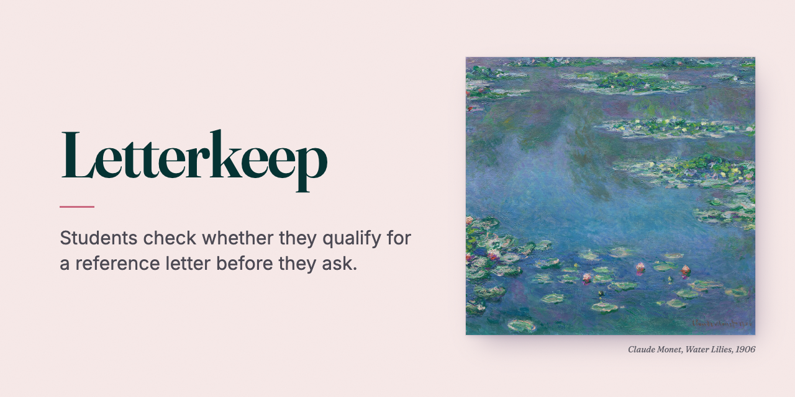
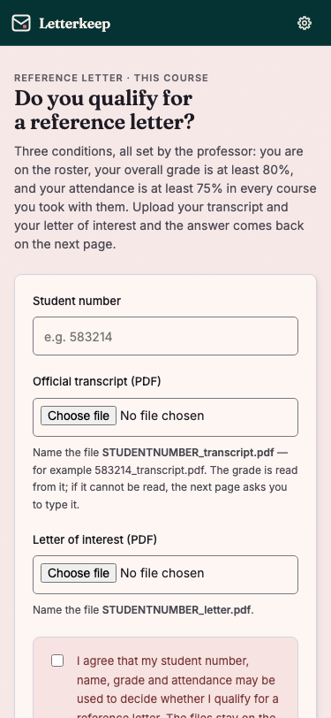
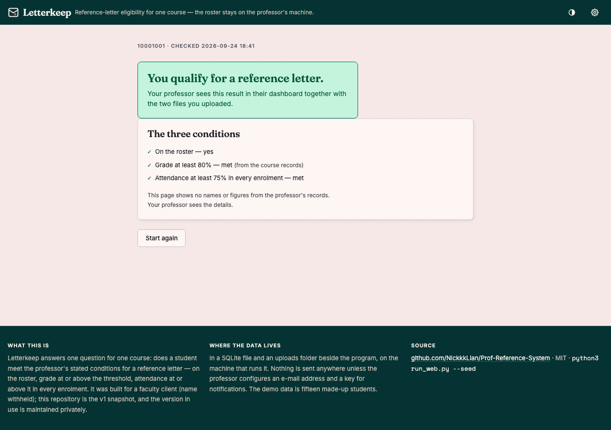
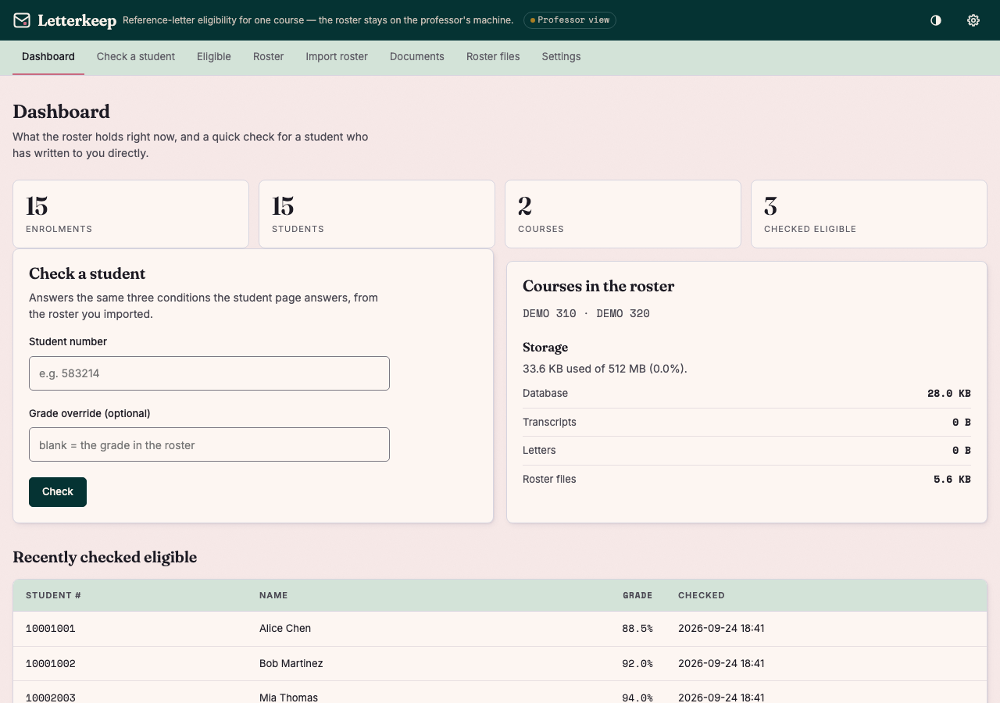
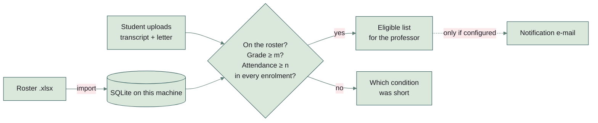

# Letterkeep



**Students check whether they qualify for a reference letter before they ask — the roster, the grades and the files never leave the professor's own machine.**

Built for a faculty client (name withheld) who was spending each term's last weeks answering the same question by
hand. This repository is the v1 snapshot, kept as a public sample; the version in use is maintained privately and is
not reflected here.

[](docs/screenshot-student.png)

**A one-page tour:** https://nickkklian.github.io/Prof-Reference-System/ — what it does and why, in a page. There is no hosted version to try: the roster, the grades and the files never leave the professor's machine, so the application runs on yours.

```bash
python3 -m pip install -r requirements.txt
python3 run_web.py --seed        # demo data, then http://127.0.0.1:5001
```

Python 3.10 or newer. macOS ships 3.9 as `/usr/bin/python3`, which cannot run this — `run_web.py` says so and stops
rather than failing inside an import.

`--seed` writes fifteen made-up students across two courses, three of them already checked as eligible, and prints
the professor's address — it is the student page plus a token, and the token is the only key to the professor's side.

---

## What it does

A professor sets two thresholds. A student uploads their transcript and a letter of interest and gets an answer to
three conditions, all read from the roster the professor imported:

1. **on the roster** — the student number appears in an imported roster file;
2. **grade** — their overall grade is at or above the grade threshold (default 80%);
3. **attendance** — their attendance is at or above the attendance threshold (default 75%) **in every enrolment**,
   not on average: one course short is not eligible.

The grade is read from the transcript PDF when it can be, and typed by the student when it cannot; which of the two
happened is recorded and shown to the professor. The student's page shows the answer and which condition is met,
but no name, enrolment or figure from the roster: anyone who knows a student number can open it.

| | |
|---|---|
|  |  |
| The student's answer | The professor's dashboard |



---

## Running it

| Command | What it does |
|---|---|
| `python3 run_web.py --seed` | demo data, then serves on `127.0.0.1:5001` |
| `python3 run_web.py --host 0.0.0.0 --port 8000` | serve to the network as well — see the note below |
| `python3 run_web.py --data-dir ~/letterkeep-data` | keep the database and uploads somewhere else |
| `python3 run_desktop.py --seed` | the same app, opens the professor's dashboard in a browser |
| `gunicorn -w 4 -b 127.0.0.1:8000 app.web:app` | behind a real server — `gunicorn` is not in `requirements.txt`, install it separately |

The default binding is **this machine only**. `--host 0.0.0.0` puts the roster on the local network, where the
professor's address is reachable by anyone who has it — a deliberate choice, not the default. Port 5001 is the
default because on macOS port 5000 belongs to AirPlay Receiver.

**The professor's address is the credential.** It is `prof_token.txt` in the data folder, beside the database; delete that file and
the next start mints a new one, which invalidates the old link.

---

## The roster file

An Excel file, one row per student. Course, section, year and term come from the import form, so the file needs only
the student columns. Each column is matched against the spellings below, in any order and any case:

| Column | Required | Accepted spellings |
|---|---|---|
| Student number | yes | `Student #`, `Student No`, `Student Number`, `Student ID`, `ID` |
| First name | yes | `First Name`, `First`, `Given Name` |
| Last name | yes | `Last Name`, `Last`, `Surname`, `Family Name` |
| Absence | yes | `%Abs`, `Abs`, `Absence`, `Absence Rate`, `Abs%`, … |
| Grade | optional | `Grade`, `Final Grade`, `Mark`, `Score` |

An absence written as `0.04` and as `4` both mean four percent; attendance is 100 minus absence. A file missing a
required column is refused and the message names what is missing.

---

## Checks

```bash
python3 -m pip install -r requirements.txt pytest
python3 -m pytest tests -q       # 26 tests
python3 break_check.py           # breaks the rule six ways; each must be caught
```

The tests cover the three places where a mistake would be silent: the rule itself (including two courses with one
short of attendance, and a row with no attendance figure, which must not read as a pass), the roster parser (the
three spellings above), and the notifier — with nothing configured it must send nothing, and the tests enforce that
by turning any outgoing request into an error rather than an e-mail.

`break_check.py` breaks the rule in a copy of the code — attendance satisfied by one course, the grade threshold
ignored, a missing figure counted as a pass, the roster aliases removed, the notifier's guard removed, every Python
called new enough — and counts a break as caught only when **the test written for it** is the one that fails, so a
suite that reddens for an unrelated reason is reported as not caught.

GitHub Actions runs the tests on Python 3.10 and 3.13, the break check, a 3.9 job that checks the app turns that
version away with a sentence rather than a traceback, and a start-up job that seeds the demo data and fetches both
pages.

---

## Where the data lives

Everything is in the data folder beside the program (`data/`, or `app/data/` when you start it with `run_web.py`;
`--data-dir` picks another): `professor_reference.db` (SQLite), `attendance_input/` (the roster files you import),
`uploads/` (transcripts and letters), `prof_token.txt`, and the two settings files. Nothing is
sent anywhere unless a notification address **and** a Brevo API key are configured in Settings; with either missing,
the app sends nothing and says so.

This handles student personal information, so where it runs matters: the desktop entry point keeps everything on one
machine, and a server deployment should sit on infrastructure that satisfies the applicable privacy legislation
(in British Columbia, FIPPA).

---

## What is not verified here

- **Desktop packaging.** `roster.spec` builds a PyInstaller bundle; it has not been built or run on the machine this
  version was written on. The checkout path (`python3 run_desktop.py`) is the one that is exercised.
- **OCR for scanned transcripts.** `transcript_parser.py` falls back to OCR when a PDF has no extractable text; that
  path needs the `tesseract` binary (`brew install tesseract`, or the UB Mannheim installer on Windows) and was not
  run here. Without it, a scanned transcript takes the student to the "type your grade" page.
- **E-mail delivery.** The notifier is tested with the request captured, never sent; no mail was sent from this
  repository.
- **The numbers in the demo data.** Fifteen made-up students, generated by `app/seed.py`.

---

## Layout

```
app/                  one package, both entry points use it
  web.py              the Flask application: student pages and professor pages
  eligibility.py      the rule, 45 lines
  database.py         SQLite schema and queries
  attendance_manager  roster (.xlsx) import
  transcript_parser   grade extraction from a transcript PDF
  notifier.py         Brevo notification (nothing configured = nothing sent)
  seed.py             the demo data
  templates/          Jinja templates
  static/             design tokens, the theme kit, one stylesheet
run_web.py            server entry point
run_desktop.py        desktop entry point (data folder beside the program)
pyversion.py          the Python version both entry points check before importing anything
break_check.py        breaks the rule six ways; each must be caught by its own test
tests/                26 tests
roster.spec           PyInstaller configuration for the desktop bundle
```

Until 2026-09-17 the same eight modules and eleven templates were in the repository twice, as `web-app/` and
`desktop-app/`, byte for byte identical apart from the launcher and the packaging spec.

## Licence

MIT — see [LICENSE](LICENSE).
